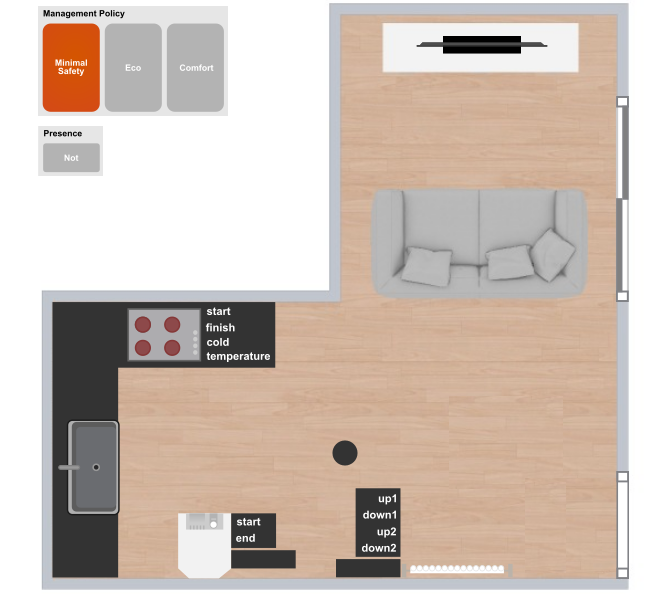

## About

This repository presents a reproduction of the scenario presented by <a href="https://www.usenix.org/conference/feedbackcomputing13/workshop-program/presentation/zhao" target="_blank">Zhao et al (2013)</a>. After modeling in <a href="http://heptagon.gforge.inria.fr/pub/heptagon-manual.pdf" target="_blank">BZR language</a>, the controller was synthesized using the <a href="http://heptagon.gforge.inria.fr/" target="_blank">Heptagon/BZR</a> and <a href="http://www.irisa.fr/vertecs/Logiciels/sigali.html" target="_blank">Sigali</a> tools. The GUI was developed using the cross-platform library mainly aimed at video game and multimedia programming: <a href="https://liballeg.org/" target="_blank">Allegro</a>.

## Screenshot



## Clone

> clone this repo to your local machine using 

```shell
$ git clone `https://github.com/ddefb/PGIA7336`
```

## Setup

For run this project with the stable branch, run the commands above in you terminal:

> add this repository first:

```shell
$ sudo add-apt-repository ppa:allegro/5.2
```

> now update and install the Allegro packages:

```shell
$ sudo apt-get update
$ sudo apt-get install liballegro5-dev
```

## Build and run the binary file

> go to PGIA7336/P5 folder

```shell
$ cd ~/PGIA7336/P5
```

> and run the make command:

```shell
$ make
```

> run the command above to execute the binary file:

```shell 
$ ./_main
```

---

## License

[](http://badges.mit-license.org)

- **[MIT license](http://opensource.org/licenses/mit-license.php)**
- Copyright 2018 © <a href="http://ddefb.me/" target="_blank">Diego Bezerra</a>.
